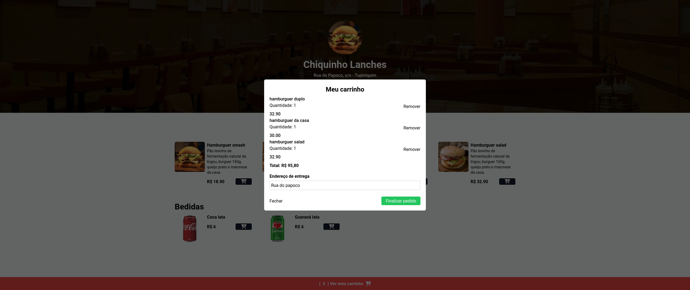

<h1 align="center">Menu</h1>

<p align="center">
    
</p>


<p align="center">
  
  
  
</p>


### Download dependencies:

```
npm start
```
> [!CAUTION]
> Não recomendado usar outro gerenciador de pacote.

### Run: 
```
npm run dev
double click "index.html" file
```

### Deploy vercel
```
order-food-omega.vercel.app
```

<h3 align="center">Desktop</h3>



<h3 align="center">Mobile</h3>

